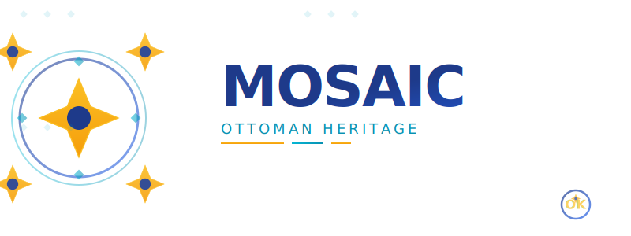

# MOSAIC SaaS Platform

**MOSAIC** is a next-generation SaaS platform that empowers businesses and creators to build, manage, and scale multi-tenant websites with beautiful Ottoman-inspired design aesthetics. Built by [Orkinosai](https://github.com/orkinosai25-org), MOSAIC combines powerful enterprise features with the elegance of historical Turkish artistic heritage.



## 🎯 Vision

MOSAIC reimagines website and content management as a service by blending:
- **Enterprise-grade multi-tenant architecture** for scalability and security
- **Ottoman/Iznik design inspiration** bringing unique cultural aesthetics to modern web
- **AI-powered automation** with intelligent agents for both public users and administrators
- **Seamless integrations** with modern payment, analytics, and development tools

Our goal is to make powerful web infrastructure accessible to everyone while celebrating Turkish cultural heritage through design.

## ✨ Core Features

### 🚀 User Onboarding & Registration
- **Streamlined sign-up flow**: Get started in minutes with intuitive onboarding
- **Email verification**: Secure account activation
- **Profile customization**: Users can personalize their workspace from day one
- **Guided setup wizard**: Step-by-step process to launch your first site
- **Documentation hub**: Comprehensive guides and video tutorials

### 💳 Payment Integration
- **Microsoft Startup Founder Hub support**: Leverage startup credits and benefits
- **Stripe integration**: Secure payment processing with support for multiple currencies
- **Flexible subscription tiers**: Free, Pro, Business, and Enterprise plans
- **Usage-based billing**: Pay only for what you use
- **Transparent pricing**: No hidden fees, clear cost breakdowns
- **Invoice management**: Automated billing and receipt generation

### 🏢 Multi-Tenant Site Management
- **Unlimited sites**: Create and manage multiple websites from one dashboard
- **Isolated environments**: Each site runs in its own secure tenant space
- **Custom domains**: Connect your own domain names
- **SSL certificates**: Automatic HTTPS for all sites
- **Staging environments**: Test changes before going live
- **Backup & restore**: Automated backups with one-click restoration

### 🎨 Theme & Branding
- **Ottoman-inspired themes**: Beautiful designs drawing from Selimiye Mosque and Blue Mosque aesthetics
- **Iznik tile patterns**: Authentic geometric patterns with 8-pointed stars, diamond tiles, and arabesques
- **Customizable color palettes**: 
  - Deep cobalt blues (#1e3a8a, #2563eb)
  - Turquoise accents (#06b6d4, #22d3ee)
  - Gold highlights (#fbbf24, #f59e0b)
- **Light & dark modes**: Elegant themes for different contexts
- **Logo integration**: Upload and manage your brand assets
- **SharePoint-inspired layouts**: Professional, enterprise-ready templates
- **Custom CSS**: Advanced users can override styles
- **Brand consistency**: Maintain unified look across all your sites

### 📊 Analytics & Insights
- **Real-time dashboards**: Monitor site performance and visitor activity
- **Traffic analytics**: Page views, unique visitors, engagement metrics
- **Conversion tracking**: Monitor form submissions and goal completions
- **User behavior analysis**: Heatmaps and session recordings (planned)
- **Custom reports**: Export data for deeper analysis
- **Performance monitoring**: Site speed and uptime tracking

### 🔌 API Integration
- **RESTful API**: Full programmatic access to platform features
- **Webhooks**: Real-time notifications for events
- **GraphQL support** (planned): Flexible data querying
- **OAuth 2.0**: Secure third-party integrations
- **SDKs**: Official client libraries for JavaScript, Python, and .NET
- **Rate limiting**: Fair usage policies with generous limits
- **API documentation**: Interactive docs with examples

### 🤖 AI-Powered Agents

#### MOSAIC Public Agent
- **Content assistance**: AI helps users create and optimize content
- **SEO recommendations**: Automated suggestions for better search rankings
- **Design guidance**: Smart recommendations for layouts and styling
- **Accessibility checks**: Ensure sites meet WCAG standards
- **24/7 availability**: Always-on support for common questions

#### Zoota Admin Agent
- **Administrative automation**: Streamline platform management tasks
- **User support**: Intelligent ticket routing and response suggestions
- **System monitoring**: Proactive issue detection and resolution
- **Analytics insights**: AI-powered trend analysis and recommendations
- **Resource optimization**: Smart scaling and cost management

## 🏛️ Design Heritage

MOSAIC's visual identity is deeply rooted in Ottoman architectural masterpieces:

### Selimiye Mosque (Edirne)
- Geometric precision of Mimar Sinan's masterpiece
- 8-pointed star patterns (Rub el Hizb)
- Perfect mathematical proportions

### Blue Mosque (Istanbul)
- Famous Iznik tile work with over 20,000 handmade tiles
- Cobalt blue color palette
- Cascading dome architecture

### Iznik Tiles
- Traditional Turkish ceramic art
- Diamond and geometric patterns
- Rich color combinations

Learn more about our design inspiration in the [logo documentation](./logo/README.md) and [Ottoman inspirations](./logo/concept/OTTOMAN_INSPIRATIONS.md).

## 📚 Documentation

- **[Quick Start - CMS](./docs/QUICK_START_CMS.md)**: Get started with CMS and Azure Blob Storage in minutes
- **[SaaS Features Overview](./docs/SaaS_FEATURES.md)**: Detailed feature comparison and roadmap
- **[Onboarding Guide](./docs/ONBOARDING.md)**: Complete user journey from sign-up to launch
- **[Azure Blob Storage Integration](./docs/AZURE_BLOB_STORAGE.md)**: Media storage, security, and usage guide
- **[Logo & Branding](./logo/README.md)**: Official brand assets and usage guidelines
- **[Design Concept](./logo/concept/DESIGN_CONCEPT.md)**: Logo design philosophy
- **[Ottoman Inspirations](./logo/concept/OTTOMAN_INSPIRATIONS.md)**: Cultural and architectural heritage

## 🚀 Getting Started

1. **Sign up**: Visit mosaic.orkinosai.com (platform launching soon)
2. **Choose your plan**: Select a subscription tier that fits your needs
3. **Create your first site**: Follow the guided setup wizard
4. **Customize**: Apply themes and branding
5. **Launch**: Go live with your new website
6. **Integrate**: Add the MOSAIC script to existing sites if needed

For detailed onboarding instructions, see our [Onboarding Guide](./docs/ONBOARDING.md).

## ☁️ Azure Blob Storage Integration

MOSAIC leverages **Azure Blob Storage** for enterprise-grade media and asset management:

### Key Features

- **Multi-Tenant Isolation**: Automatic tenant data separation for security
- **Scalable Storage**: Unlimited capacity for user uploads, images, and documents
- **Geo-Redundant**: Data replicated across regions for high availability
- **Secure by Default**: 
  - TLS 1.2 encryption in transit
  - Data encrypted at rest
  - No public access allowed
  - SAS tokens for temporary secure access

### Storage Account Details

- **Account Name**: `mosaicsaas`
- **Primary Endpoint**: `https://mosaicsaas.blob.core.windows.net/`
- **Location**: UK South (`uksouth`)
- **Redundancy**: Standard_RAGRS (Read-Access Geo-Redundant Storage)

### Supported Content Types

| Container | Purpose | File Types |
|-----------|---------|------------|
| **Images** | User images, logos, banners | JPEG, PNG, GIF, WebP, SVG |
| **Documents** | User documents, PDFs | PDF, Word, Excel, Text, CSV |
| **User Uploads** | General media assets | All supported types |
| **Backups** | Tenant backups | All files |

### Usage Example

```bash
# Upload an image (requires tenant authentication)
curl -X POST https://api.mosaic.app/api/media/images \
  -H "X-Tenant-Id: your-tenant-id" \
  -F "file=@logo.png"

# List tenant files
curl -X GET "https://api.mosaic.app/api/media/list?containerType=images" \
  -H "X-Tenant-Id: your-tenant-id"
```

### Security & Migration

- ✅ **Secure**: Public access disabled, HTTPS enforced, tenant isolation
- ✅ **Compliant**: Encryption enabled, TLS 1.2 minimum
- ✅ **Reliable**: Geo-redundant storage with 99.99% availability SLA
- ✅ **Migrated**: Easy migration from local storage or other cloud providers

For detailed information, see the [Azure Blob Storage Integration Guide](./docs/AZURE_BLOB_STORAGE.md).

## 💼 For Startups

MOSAIC is proud to support startups through the **Microsoft for Startups Founder Hub**:
- Access to Azure credits for infrastructure
- Preferred pricing for qualifying startups
- Technical support and architecture guidance
- Scalability consulting

[Learn more about startup benefits](./docs/SaaS_FEATURES.md#startup-support)

## 🤝 Contributing

We welcome contributions! Whether it's:
- 🐛 Bug reports
- 💡 Feature suggestions
- 📝 Documentation improvements
- 🎨 Design enhancements

Please check our contribution guidelines (coming soon).

## 📜 License

This project is proprietary software by Orkinosai. See LICENSE file for details.

## 📞 Contact & Support

- **Website**: [orkinosai.com](https://orkinosai.com) (coming soon)
- **Repository**: [github.com/orkinosai25-org/mosaic](https://github.com/orkinosai25-org/mosaic)
- **Email**: support@orkinosai.com (coming soon)
- **Documentation**: See [docs](./docs/) folder

---

**Built with ❤️ by [Orkinosai](https://github.com/orkinosai25-org)**  
**Inspired by Ottoman heritage** • **Powered by modern technology**
