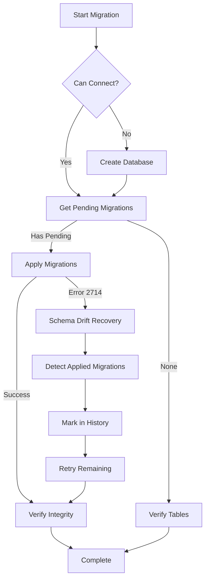

# Database Migration Recovery Guide

## Overview

This guide explains the enhanced database migration and recovery system for OrkinosaiCMS, adapted from [Oqtane CMS](https://github.com/oqtane/oqtane.framework) best practices to handle schema drift, migration errors, and database inconsistencies.

## Problem Statement

### Common Migration Errors

1. **SQL Error 2714**: "There is already an object named 'TableName' in the database"
   - **Cause**: Tables exist from previous partial migrations
   - **Impact**: Migration fails, database left in inconsistent state

2. **SQL Error 208**: "Invalid object name 'TableName'"
   - **Cause**: Expected tables missing from database
   - **Impact**: Application cannot start, seeding fails

3. **Schema Drift**
   - **Cause**: Manual database changes, migrations applied out of order, or partial migration failures
   - **Impact**: `__EFMigrationsHistory` doesn't match actual database state

4. **Identity Tables Missing**
   - **Cause**: `AddIdentityTables` migration not applied
   - **Impact**: Admin login fails, UserManager operations fail

## Solution Architecture

### Enhanced Migration Service

OrkinosaiCMS now includes `DatabaseMigrationService`, a comprehensive migration handler inspired by Oqtane's `DatabaseManager` pattern:

```
OrkinosaiCMS.Infrastructure/
└── Services/
    └── DatabaseMigrationService.cs
```

### Key Features

1. **Automatic Schema Drift Detection**
   - Detects when tables exist but migrations aren't recorded in history
   - Identifies which migrations have already been applied based on table presence
   - Automatically marks applied migrations in `__EFMigrationsHistory`

2. **Intelligent Recovery**
   - Catches SQL Error 2714 (object already exists)
   - Determines which migrations caused the conflict
   - Adds those migrations to history without re-running them
   - Continues with remaining pending migrations

3. **Database Creation**
   - Automatically creates database if it doesn't exist
   - Uses EF Core's `IRelationalDatabaseCreator` for provider-agnostic creation
   - Validates database connectivity before attempting migrations

4. **Comprehensive Logging**
   - Logs each step of the migration process
   - Provides actionable error messages
   - Tracks which migrations are applied, pending, or skipped

5. **Integrity Verification**
   - Verifies critical tables exist after migration
   - Checks database can be queried
   - Reports any integrity issues

## How It Works

### Migration Process Flow



### Detection Logic

The service determines which migrations are already applied by checking for key tables:

| Migration | Detection Criteria |
|-----------|-------------------|
| `InitialCreate` | Tables: Sites, Modules, Pages exist |
| `AddIdentityTables` | Tables: AspNetUsers, AspNetRoles, AspNetUserRoles exist |
| `AddSubscriptionEntities` | Tables: Customers, Subscriptions exist |
| `AddThemeEnhancements` | Theme-related columns with updated schema |

### Recovery Algorithm

1. **Catch Migration Exception**
   ```csharp
   catch (SqlException sqlEx) when (sqlEx.Number == 2714)
   {
       // Object already exists - schema drift detected
   }
   ```

2. **Analyze Existing Schema**
   ```csharp
   var existingTables = await GetExistingTablesAsync();
   var appliedMigrations = await DetermineMigrationsAppliedAsync(
       existingTables, pendingMigrations);
   ```

3. **Update Migration History**
   ```csharp
   foreach (var migration in appliedMigrations)
   {
       await AddMigrationToHistoryAsync(migration);
   }
   ```

4. **Retry Migrations**
   ```csharp
   var remainingMigrations = pendingMigrations.Except(appliedMigrations);
   await _context.Database.MigrateAsync();
   ```

## Usage

### Automatic (Default)

The migration service runs automatically on application startup via `SeedData.InitializeAsync()`:

```csharp
public static async Task InitializeAsync(IServiceProvider serviceProvider)
{
    var migrationService = new DatabaseMigrationService(context, logger, configuration);
    var result = await migrationService.MigrateDatabaseAsync();
    
    if (!result.Success)
    {
        // Handle error with fallback for InMemory databases
    }
}
```

### Manual Execution

You can also manually trigger migration and recovery:

```bash
# Run the application normally - migrations apply automatically
dotnet run --project src/OrkinosaiCMS.Web

# Or use EF Core CLI for manual control
dotnet ef database update --project src/OrkinosaiCMS.Infrastructure
```

## Handling Specific Scenarios

### Scenario 1: Clean Database (Fresh Install)

**Expected Behavior:**
- Database created automatically
- All 5 migrations applied in order
- Seed data populated
- Admin user created

**Process:**
1. Service detects database doesn't exist
2. Creates empty database using `IRelationalDatabaseCreator`
3. Applies all migrations: InitialCreate → AddThemeEnhancements → AddSubscriptionEntities → AddIdentityTables → SyncPendingModelChanges
4. SeedData populates initial records
5. IdentityUserSeeder creates admin user

### Scenario 2: Schema Drift (Partial Migration)

**Symptoms:**
- SQL Error 2714: "Object already exists"
- Some tables exist but not all
- Migration history missing entries

**Recovery Process:**
1. Service attempts migration
2. Catches SQL Error 2714
3. Queries `INFORMATION_SCHEMA.TABLES` for existing tables
4. Matches tables to known migrations
5. Adds matched migrations to `__EFMigrationsHistory`
6. Retries migration with remaining migrations only

**Example:**
```
Initial State:
  Tables: Sites, Modules, Pages, Themes (from InitialCreate + AddThemeEnhancements)
  History: [empty]

Detection:
  - InitialCreate detected (Sites, Modules, Pages exist)
  - AddThemeEnhancements detected (Themes table has new columns)

Recovery:
  1. INSERT INTO __EFMigrationsHistory ('20251129175729_InitialCreate', ...)
  2. INSERT INTO __EFMigrationsHistory ('20251209164111_AddThemeEnhancements', ...)
  3. Migrate remaining: AddSubscriptionEntities, AddIdentityTables, SyncPendingModelChanges

Result: ✓ Success
```

### Scenario 3: Missing Identity Tables

**Symptoms:**
- Application starts but admin login fails
- Error: "Invalid object name 'AspNetUsers'"
- Identity tables don't exist

**Automatic Fix:**
1. Service detects `AspNetUsers` table doesn't exist
2. Applies `AddIdentityTables` migration
3. IdentityUserSeeder runs after successful migration
4. Admin user created with default credentials

### Scenario 4: Database Exists But Empty

**Symptoms:**
- Database exists but has no tables
- Migration history table missing

**Recovery Process:**
1. Service connects to existing database
2. Creates `__EFMigrationsHistory` table
3. Applies all migrations in order
4. Seeds initial data

## Migration History Management

### Adding Migrations to History Manually

If you need to manually mark a migration as applied (advanced scenario):

```sql
-- Add migration to history
INSERT INTO __EFMigrationsHistory (MigrationId, ProductVersion)
VALUES ('20251215015307_AddIdentityTables', '10.0.0');
```

### Checking Migration Status

```sql
-- List all applied migrations
SELECT MigrationId, ProductVersion 
FROM __EFMigrationsHistory 
ORDER BY MigrationId;

-- Check pending migrations (from app logs)
-- Log: "Found X pending migrations"
```

### Removing Failed Migration from History

```sql
-- CAUTION: Only do this if migration failed and database changes were rolled back
DELETE FROM __EFMigrationsHistory 
WHERE MigrationId = '20251215224415_SyncPendingModelChanges';

-- Then retry migration
-- dotnet ef database update
```

## Troubleshooting

### Issue: Migration Still Fails After Recovery

**Possible Causes:**
1. Database user lacks permissions
2. Active connections blocking schema changes
3. Corrupt migration file

**Solutions:**
```bash
# 1. Verify database permissions
# User needs: CREATE TABLE, ALTER TABLE, CREATE INDEX permissions

# 2. Close all connections
# In SQL Server Management Studio: Database → Tasks → Take Offline → Bring Online

# 3. Try manual migration
dotnet ef database update --verbose --project src/OrkinosaiCMS.Infrastructure

# 4. If all else fails, backup data and recreate
# Backup data → Drop database → Let app recreate → Restore data
```

### Issue: "Cannot convert null literal" warnings

**Description:** C# nullable reference warnings in code

**Impact:** None - these are compile-time warnings, not errors

**Fix:** (Optional) Suppress warnings or update code with null checks

### Issue: EF1002 Warning about SqlQueryRaw

**Description:** Warning about SQL injection in table checking code

**Status:** Safe - table names come from controlled array, validated with `IsValidTableName()`

**Suppression:** Add `#pragma warning disable EF1002` if desired

## Configuration

### Database Provider Selection

Priority order:
1. Environment variable: `DatabaseProvider`
2. appsettings.{Environment}.json
3. appsettings.json
4. Default: SqlServer

**Example:**
```json
{
  "DatabaseProvider": "SqlServer",
  "ConnectionStrings": {
    "DefaultConnection": "Server=.;Database=OrkinosaiCMS;Trusted_Connection=True;..."
  }
}
```

### Migration Retry Policy

Currently migrations use single attempt with recovery.

**Future Enhancement:** Could add retry policy with exponential backoff:
```csharp
var retryPolicy = Policy
    .Handle<SqlException>(ex => ex.Number == -2) // Timeout
    .WaitAndRetryAsync(3, attempt => TimeSpan.FromSeconds(Math.Pow(2, attempt)));
```

## Oqtane Patterns Adopted

This implementation adapts several patterns from Oqtane CMS:

1. **DatabaseManager Pattern**
   - Central migration orchestration
   - Step-by-step validation (CreateDatabase → Migrate → Verify)
   - Comprehensive error handling

2. **Migration History Management**
   - Manual history table manipulation when needed
   - Version-based upgrade logic
   - Tenant-specific migration tracking (simplified for single-tenant)

3. **Module Versioning**
   - Track which migrations correspond to which features
   - Allow partial migration application
   - Support upgrade paths across versions

4. **Error Recovery**
   - Catch specific SQL errors
   - Provide actionable error messages
   - Log detailed diagnostic information

## Comparison: Before vs. After

### Before Enhancement

```
❌ SQL Error 2714 → Application crash
❌ Manual intervention required
❌ Generic error messages
❌ No automatic recovery
❌ Database state unclear
```

### After Enhancement

```
✅ SQL Error 2714 → Automatic recovery
✅ Self-healing migrations
✅ Detailed, actionable logs
✅ Multiple recovery strategies
✅ Complete state visibility
```

## Best Practices

### For Developers

1. **Always test migrations on clean database first**
   ```bash
   # Create test database
   dotnet ef database drop --force
   dotnet ef database update
   ```

2. **Use descriptive migration names**
   ```bash
   dotnet ef migrations add AddUserProfileFields
   # Not: dotnet ef migrations add Update1
   ```

3. **Review generated migration code**
   - Check Up() and Down() methods
   - Verify idempotency where possible
   - Add data migration code if needed

4. **Never edit applied migrations**
   - Create new migration instead
   - Use `dotnet ef migrations add FixPreviousMigration`

### For Deployment

1. **Test migrations in staging first**
2. **Backup production database before deployment**
3. **Use connection string with appropriate permissions**
4. **Monitor application logs during startup**
5. **Have rollback plan ready**

### For Production

1. **Configure connection string via environment variables**
   ```bash
   export ConnectionStrings__DefaultConnection="Server=prod-db;..."
   ```

2. **Enable detailed logging temporarily if issues occur**
   ```json
   {
     "Logging": {
       "LogLevel": {
         "OrkinosaiCMS.Infrastructure.Services.DatabaseMigrationService": "Debug"
       }
     }
   }
   ```

3. **Monitor for schema drift**
   - Regular integrity checks
   - Alert on migration failures
   - Track migration history

## References

- **Oqtane Framework**: https://github.com/oqtane/oqtane.framework
- **Oqtane Docs - Database Migrations**: https://docs.oqtane.org/guides/migrations/
- **EF Core Migrations**: https://learn.microsoft.com/en-us/ef/core/managing-schemas/migrations/
- **Problem Statement**: Database schema drift, login failures, missing Identity tables

## Support

If you encounter migration issues:

1. **Check logs**: `App_Data/Logs/` directory
2. **Review this guide**: Troubleshooting section
3. **Verify database state**:
   ```sql
   SELECT * FROM __EFMigrationsHistory;
   SELECT TABLE_NAME FROM INFORMATION_SCHEMA.TABLES;
   ```
4. **Report issues**: Include full error message and migration history

---

**Last Updated:** 2025-12-16  
**Version:** 1.0.0  
**Author:** GitHub Copilot SWE Agent (copilot/fix-database-schema-errors)
