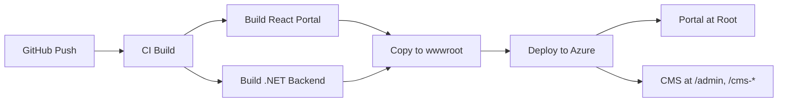

# MOSAIC Deployment Routing Fix

## Overview

This document describes the routing fix implemented to correctly serve the MOSAIC portal landing page at the root URL instead of showing OrkinosaiCMS.Web Blazor components.

## Problem Statement

After deployment to Azure, the site was incorrectly displaying:
- OrkinosaiCMS.Web Blazor components at the root URL
- Demo pages (Home, Counter, Weather) showing "Not Found" errors
- CMS UI visible to unauthenticated users
- Portal landing page not being served

## Solution

### 1. Routing Architecture

The application now uses a multi-layered routing strategy:

```
┌─────────────────────────────────────────┐
│         Azure Web App (MOSAIC)          │
└─────────────────────────────────────────┘
                    │
        ┌───────────┴───────────┐
        │                       │
        ▼                       ▼
┌──────────────┐      ┌──────────────────┐
│ React Portal │      │   Blazor CMS     │
│   (Root /)   │      │ (/cms-*, /admin) │
└──────────────┘      └──────────────────┘
        │                       │
        │                       │
        ▼                       ▼
┌──────────────┐      ┌──────────────────┐
│ Public Users │      │ Authenticated    │
│ Landing Page │      │ Site Management  │
└──────────────┘      └──────────────────┘
```

### 2. Key Changes

#### A. Removed Demo Pages
- **Deleted**: `Counter.razor`, `Weather.razor`, `Home.razor`
- **Reason**: These were OrkinosaiCMS demo pages that shouldn't be accessible at root level
- **Impact**: Clean routing without conflicting page routes

#### B. Updated Program.cs Routing

**Fallback Routing Logic:**
```csharp
app.MapFallback(async context =>
{
    var path = context.Request.Path.Value ?? "/";
    
    // Blazor CMS routes bypass to framework
    if (path.StartsWith("/cms-") || path.StartsWith("/admin") || /* framework paths */)
    {
        context.Response.StatusCode = 404;
        return;
    }
    
    // All other routes serve React portal
    await context.Response.SendFileAsync("wwwroot/index.html");
});
```

**Benefits:**
- React portal serves at root `/` by default
- CMS routes preserved under specific paths
- Clean separation between portal and CMS

#### C. Authentication Protection

**Middleware Configuration:**
```csharp
app.UseAuthentication();
app.UseAuthorization();

// Protect CMS routes
app.Use(async (context, next) =>
{
    var path = context.Request.Path.Value ?? "/";
    
    if (path.StartsWith("/cms-") || path.StartsWith("/admin"))
    {
        if (!context.User?.Identity?.IsAuthenticated ?? true)
        {
            context.Response.Redirect("/admin/login?returnUrl=" + Uri.EscapeDataString(path));
            return;
        }
    }
    
    await next();
});
```

**Security Features:**
- CMS routes require authentication
- Automatic redirect to login page
- Return URL preserved for post-login navigation
- Portal remains public for onboarding

### 3. URL Routing Map

| URL Pattern | Served By | Access Level | Purpose |
|------------|-----------|--------------|---------|
| `/` | React Portal | Public | Landing page with registration/login |
| `/dashboard` | React Portal | Public* | User dashboard (handles auth internally) |
| `/sites` | React Portal | Public* | Site management (handles auth internally) |
| `/admin/login` | Blazor CMS | Public | Authentication page |
| `/admin/*` | Blazor CMS | Authenticated | Admin interface |
| `/cms-home` | Blazor CMS | Authenticated | CMS homepage |
| `/cms-*` | Blazor CMS | Authenticated | CMS pages |
| `/_framework/*` | Blazor | N/A | Framework assets |
| `/api/*` | API Controllers | Varies | Backend API |
| All other paths | React Portal | Public | SPA fallback |

*React portal handles authentication internally

### 4. Deployment Flow



**Deployment Steps:**
1. Build React portal (`npm run build` in `/frontend`)
2. Build .NET backend (`dotnet publish`)
3. Copy React build to `/publish/wwwroot/`
4. Deploy to Azure Web App
5. React portal index.html serves at root
6. Blazor CMS accessible at authenticated routes

### 5. User Journey

#### Unauthenticated User
1. Visits `https://mosaic-saas.azurewebsites.net/`
2. Sees MOSAIC portal landing page (React)
3. Can click "Register" or "Sign In"
4. Cannot access `/admin` or `/cms-*` (redirected to login)

#### Authenticated User
1. Logs in via portal or `/admin/login`
2. Redirected to dashboard (React portal)
3. Can create/manage sites via portal
4. Can access CMS admin (`/admin`) for site configuration
5. Can access CMS pages (`/cms-*`) for content management

### 6. Testing the Fix

#### Local Testing
```bash
# Build frontend
cd frontend
npm ci
npm run build

# Copy to wwwroot
cd ..
cp -r frontend/dist/* src/OrkinosaiCMS.Web/wwwroot/

# Run backend
cd src/OrkinosaiCMS.Web
dotnet run

# Test URLs
curl http://localhost:5000/  # Should serve React portal
curl http://localhost:5000/admin  # Should redirect to login
curl http://localhost:5000/admin/login  # Should serve login page
```

#### Production Testing
```bash
# After deployment
curl https://mosaic-saas.azurewebsites.net/  # React portal
curl -I https://mosaic-saas.azurewebsites.net/admin  # 302 redirect to login
curl https://mosaic-saas.azurewebsites.net/admin/login  # Login page
```

### 7. Troubleshooting

#### Issue: Root still shows Blazor
**Symptoms:** Root URL serves Blazor instead of React
**Solution:** 
- Verify React build is in `wwwroot/`
- Check `wwwroot/index.html` exists
- Verify fallback routing is configured
- Check static files middleware order

#### Issue: CMS accessible without auth
**Symptoms:** Can access `/cms-*` or `/admin` without login
**Solution:**
- Verify authentication middleware is registered
- Check middleware order (UseAuthentication before route protection)
- Verify auth state provider is working

#### Issue: 404 on CMS routes
**Symptoms:** Cannot access `/admin` or `/cms-*` even when authenticated
**Solution:**
- Check fallback routing logic
- Verify CMS routes are excluded from fallback
- Check Blazor routing configuration

### 8. Branding Updates

All OrkinosaiCMS branding replaced with MOSAIC:
- Login page: "MOSAIC CMS Admin"
- Navigation: "MOSAIC CMS"
- Color scheme: Ottoman blues (#1e3a8a, #2563eb)
- Portal: Ottoman-inspired design throughout

### 9. Future Enhancements

- [ ] Add OAuth integration (Google, Microsoft)
- [ ] Implement JWT authentication for API
- [ ] Add two-factor authentication
- [ ] Create registration flow in React portal
- [ ] Implement tenant-specific subdomain routing
- [ ] Add SSO for enterprise customers

## References

- [Portal UI Design](./portal-ui.md)
- [Onboarding Guide](./ONBOARDING.md)
- [Architecture Overview](./architecture.md)
- [Deployment Guide](./DEPLOYMENT_GUIDE.md)

---

**Last Updated:** December 2024  
**Author:** Orkinosai Team  
**Status:** ✅ Implemented and Deployed
